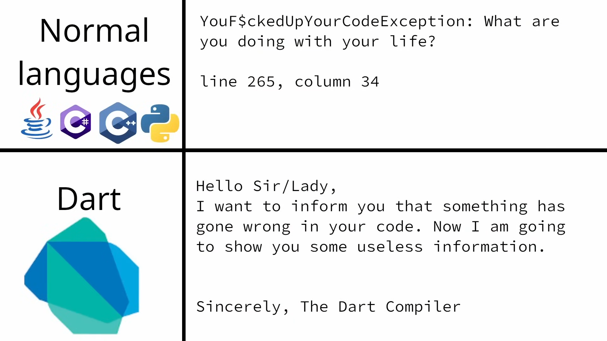

## DATA TYPES / VARIABLES

### Method 1:
- `int`
- `double`
- `bool`
- `String`
- `dynamic` (can store any datatype) **[Not recommended]**

```dart
dynamic value = '12334';
print(value.runtimeType); // String
```

### Method 2:
Using `var`, `final`, or `const`:

```dart
var someValue = '10';
print(someValue); // 10
print(someValue.runtimeType); // String
someValue = 10; // Error, because `someValue` is an integer
print(someValue.runtimeType);
```
- **Difference between `var`, `final`, and `const`**:
  - Values in `var` can be reassigned, whereas values in `final` and `const` cannot be reassigned.
  - `var` is mutable.
- **Difference between `final` and `const`**:
  - `final` is a runtime constant:

    ```dart
    final anotherValue = DateTime.now(); // Runtime constant
    print(anotherValue);
    ```
  - `const` is a compile-time constant:

    ```dart
    // const thirdValue = DateTime.now(); // Error: compile-time constant required
    const thirdValue = 10;
    print(thirdValue);
    ```

### Optional Variables:
- Variables can either hold a specific type `String`/`int`/`bool` or be `null` (nullable)
 ```dart
  int some1 = 0; //Does not mean some does not have a value, it DOES have a value which is 0.
  ```
- (Only after dart SDK >v2.0.0)
  ```dart
  int some2 = null;
- this shows an error: A value of type 'Null' cannot be assigned to a variable of type int.
  ```dart
  int? some3 = null;
  ``` 
- adding a `?` after the datatype to show that it is an optional variable
  ```dart
  String? sampleValue;
  print(sampleValue); // null
  sampleValue = '454 Hello World';
  print(sampleValue); // 454 Hello World
  sampleValue = null;
  print(sampleValue); // null
  ```
- this is called as `Sound null safety`
  #### Sound null safety
  ```dart
  String? sampleValue;
  print(sampleValue); // null
  sampleValue = '454 Hello World';
  print(sampleValue.length); // 15
  sampleValue = null;
  print(sampleValue.length); // Throws an error
  ```
  - **Why the error?**
    - Property length cannot be unconditionally accessed because the receiver can be null, In easier words,  
    **The dart compiler knows that the value is null**  
    and hence, the error
  
  ```dart
  String? sampleValue;
  print(sampleValue); // null
  sampleValue = '454 Hello World';
  print(sampleValue.length); // 15
  sampleValue = null;
  print(sampleValue!.length); // Runtime error
  ```
  - The above code gives a runtime error, which means the code will run, but the output for the last line: `print(sampleValue!.length)` will not run as expected
  
  - The issue with the runtime error can be fixed by replacing the `!` with a `?`
    ```dart
    String? sampleValue;
    print(sampleValue); // null
    sampleValue = '454 Hello World';
    print(sampleValue.length); // 15
    sampleValue = null;
    print(sampleValue?.length); // null
    ```
  - If `sampleValue = null`, the last line will give the output as `null`.

    ```dart
    String? sampleValue;
    print(sampleValue); // null
    sampleValue = '454 Hello World';
    print(sampleValue.length); // 15
    sampleValue = 'goodmorning';
    print(sampleValue?.length); // 11
    ```
  - For example, if `sampleValue = 'goodmorning'`, there is no need of the question mark in the `print(sampleValue?.length)`. It prints the length of the `sampleValue` variable which is **11**


<!-- ### Summary:
- Every variable must have a type, but the syntax for specifying a type is optional.
- Variables can either hold a specific type `String`/`int`/`bool` or be `null` (nullable) -->
